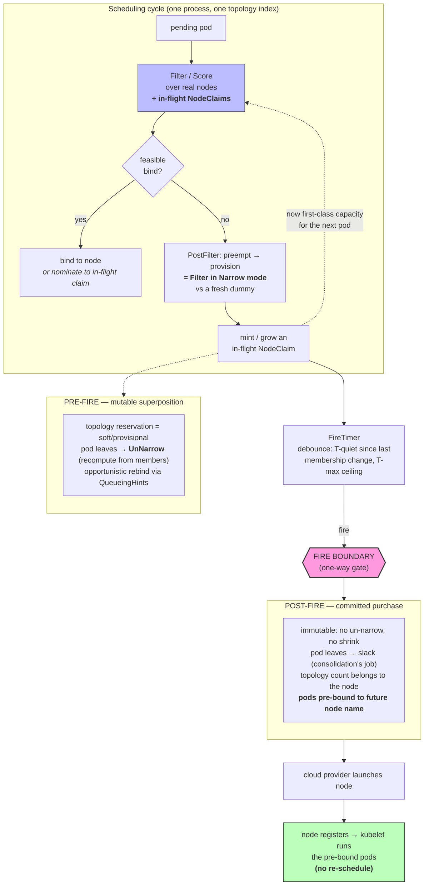

# Provisioning in the kube-scheduler cycle

**The pitch in one line:** in-flight NodeClaims become a first-class concept the
scheduling cycle already has to reason about — and once they do, provisioning stops
racing the scheduler, because it *is* the scheduler.

---

## Three claims

### 1. The cycle already has to think about in-flight capacity — so this isn't new surface, it's honest surface

Topology spread proves it. Empty cluster, `maxSkew=1`, zones {a,b,c}, three spread
pods each needing a node:

- If the scheduler only counts **launched** nodes, every pod's provisioning decision
  reads `0/0/0` and picks zone-a → **3/0/0, maxSkew violated.**
- Provisioning latency (minutes–hours) always dwarfs scheduling latency (ms), so
  "just wait for the node to be real" is blind exactly when the next decision is made.

**Conclusion:** to spread correctly across capacity it's provisioning, the cycle
*must* count committed-but-unlaunched claims. This is true no matter where
provisioning lives. We're not adding a concept the scheduler could avoid — we're
naming one it already needs. Every existing Filter/Score plugin that reasons about
capacity reasons about in-flight claims the same way it reasons about nodes.

### 2. Keeping existing behavior is trivial

The default follow-up order is unchanged: **bind → preempt → provision → wait.**

- Provisioning only fires when **no existing node is feasible** — which is exactly
  `PostFilter`'s native trigger (Filter failed everywhere). Nothing changes for pods
  that schedule today.
- The speculative "should we open a brand-new node?" (the *dummy*) lives **only** in a
  tiny PostFilter plugin: it's `Filter` run in **Narrow** mode against a fresh
  superposition. No new scheduling logic — the same plugins, pointed at a claim
  instead of a node.
- In-flight claims are the *only* new first-class concept in the cycle. Everything
  else is the scheduler you already have.

So the blast radius is: teach the cycle one new capacity type, and add one small
PostFilter plugin. Default behavior is byte-for-byte the same.

### 3. The payoff: in-flight NodeClaims can't race the scheduler, because it's the same process

Today the split-brain is a *distributed systems* problem — the autoscaler and the
scheduler are separate processes reasoning about divergent, informer-lagged state,
and they race across the node-launch window.

Move provisioning into the cycle and the race **disappears by construction:** one
process, one topology index, one consistent view maintained the entire time a claim
is launching. Because the scheduler keeps the placement correct across the whole
launch, we get the thing nobody else can:

> **Pods pre-bind to the claim's future node name at fire time. When the node
> registers, kubelet just runs them — no second trip through scheduling.**

The autoscaler+scheduler world pays provisioning latency *twice* (launch, then
re-schedule against the new node). We pay it **once**. The correctness the scheduler
maintained across the launch is what earns the skipped round-trip — and it's only
possible because there's no other process to disagree with.

---

## The architecture

**The fire boundary is the whole trick.** Before it, a claim is a mutable
superposition — cheap to reshape, `UnNarrow` on departure, safe to opportunistically
abandon if a real node opens up. After it, it's a purchase you can't take back — so a
departing pod just leaves slack and the topology count belongs to the node, not the
pod. The dangerous "re-solve strands a pod already committed to this claim" case is
**harmless pre-fire** (nothing bought) and **impossible post-fire** (nothing
re-solves). The one-way gate is what makes the mutable side free and the committed
side trivial.

---

## What's built vs. what's the ask

**Built (pure engine, `-race` clean):** the fire boundary + `UnNarrow` + demand-driven
`FireTimer`; the three-tier candidate model (existing / in-flight / dummy); topology
spread as cycle-native state; full node-selector operator semantics (In/NotIn/Exists/
Gt/Lt) ported from Karpenter; greedy solver at packing parity.

**The ask (live-cycle wiring, the reviewable follow-up):** nominate-to-NodeClaim
(`NominatedNodeName` now, `NominatedNodeClaimName` in the KEP); opportunistic rebind
via QueueingHints; pre-bind-at-fire + unbind-on-launch-failure. These need the live
scheduler cycle — the pure batch engine can't host them.

**The one edge to poke first:** a pod pre-bound to a node that doesn't exist yet is a
new lifecycle state; launch failure (stockout/quota) needs a clean unbind/re-queue
path. Cascading requeues are otherwise **precedented by preemption** and **bounded by
the fire boundary** (pre-fire cascades converge like preemption; post-fire can't
propagate).
