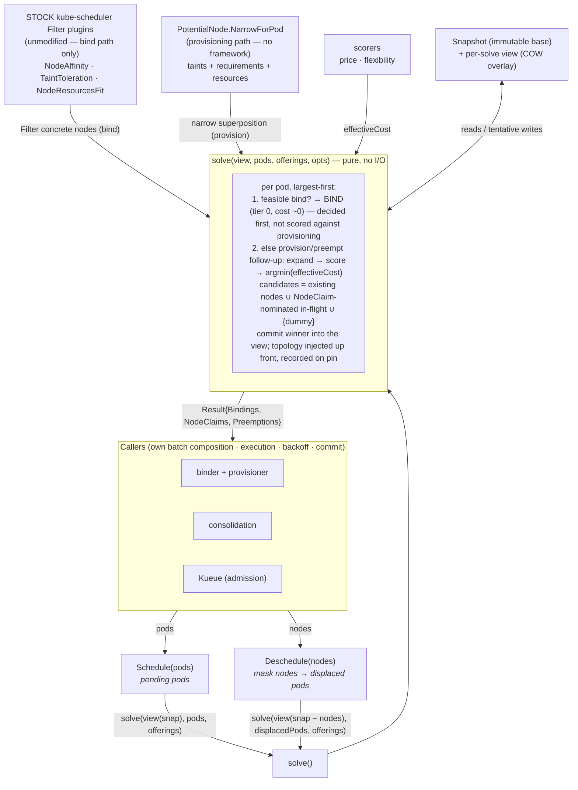

# POC Design Decisions

**Last updated:** 2026-06-26
**Scope:** the unified scheduling POC in this `pkg/scheduler/provisioning/` package — a single function that evaluates binding to existing nodes, provisioning new ones, and consolidation on one cost axis.

This doc records the **major design questions** the POC has taken a stance on (D1–D19), with the rationale and status of each, plus the **open questions** (O1–O7) still undecided. It is the reader's-digest entry point for the design.

Each decision entry: **Stance** what was decided, **Why** the reasoning, **Status** built / designed / decided-not-built / changed-my-mind. The "Open Design Questions" section at the end holds the live forks — things still genuinely undecided, not stances.

---

## Architecture

The two public entry points, `Schedule(pods)` and `Deschedule(nodes)`, are thin; both build a per-solve `view` over the immutable cluster `Snapshot` and call the shared **`solve()`** core. `solve()` reuses the real kube-scheduler **framework plugins** (modified to understand PotentialNodes) for feasibility, and the local **scorers** for the cost decision. It returns a plan; the **caller** executes it.

Key shapes the diagram encodes (each a decision below): `solve()` is the single engine both entry points share (D2, D11); it's a **pure function** that returns a plan and never executes (D13); the caller owns batch composition / execution / failure handling (D14); the **bind path filters concrete nodes with stock (unmodified) kube-scheduler plugins** while the **provisioning path narrows superpositions via `NarrowForPod`** off the framework (D19), with the cost decision as the **scorer `argmin`** (D2, D7); cluster state is an **immutable Snapshot + per-solve view** (D10); and `Deschedule` is just `solve` over a node-removed view (D11).

---

## The two meta-stances

Everything below reduces to two commitments:

1. **Marginal cost of displacement is the universal currency.** Bind, provision, preempt, and consolidate are not different mechanisms — they are one `argmin` over what each decision costs, *including the cost of re-placing whatever it displaces*. This makes the scheduler recursive (a displacing action's cost is defined by re-solving the placement of what it displaced) and is what unifies the scheduler and the autoscaler. No current system models it because the scheduler and autoscaler each see only half — naming it is what Gluon exists to do. The decisions D1–D3 below are this principle applied to provisioning, preemption, and the candidate ordering.
2. **`Schedule()` is a pure, batch-scoped decision function; everything stateful belongs to the caller.** Execution, bind-failure handling, backoff, batch composition, and commit are the caller's. This is what lets one engine serve provisioning, consolidation, and admission (Kueue) without change.

---

## Economic model (the spine)

### D1. What justifies provisioning a new node?
- **Stance:** Never cost alone. Binding to capacity you intend to *keep* is free (marginal cost ~0), so provisioning is justified only by **(a)** an unsatisfiable-elsewhere scheduling term, or **(b)** consolidation pairing (launched while strictly more expensive capacity is decommissioned).
- **Why:** Provisioning is *always* strictly more expensive than reusing already-paid capacity, so "provision because it's cheaper" is never rational. The early "cheap spot beats existing on-demand" intuition compared total prices and was economically backwards.
- **Status:** Decided; reflected in default `Schedule()` behavior (bind-first).

### D2. How do bind / provision / pack-onto-in-flight compete?
- **Stance:** One marginal-cost axis, `argmin`, ties broken by tier (`existing < in-flight < dummy`) — but **bind is decided first, not scored against provisioning** (see D17). A pod with a feasible bind takes tier 0 (cost ~0) and never enters the provisioning competition; only the unschedulable remainder is scored across in-flight and dummy tiers.
- **Why:** Karpenter hard-codes the `existing → in-flight → new` ordering; here it *falls out* of marginal cost (existing ≈ 0 ≤ in-flight delta ≤ a whole new node) rather than being a gate. Because binding retained capacity is ~$0 and provisioning is always >$0 (D1), bind always wins when feasible — so scoring it against provisioning re-derives a known answer at full catalog-width cost. Bind-first factors that out (D17); the in-flight tier is NodeClaim-nominated capacity tracked by the nominator (D18), not a batch-local structure. Real nodes still win ties (no launch latency, no stockout risk).
- **Status:** Three-tier candidate model built in `solve()`. Bind-first factoring (D17) **built** — `solve()` short-circuits to a bind when any existing node is feasible and only then builds/scores the in-flight+dummy tiers. NodeClaim-nominated in-flight tier (D18) remains decided-design (needs the caller/queue machinery in O7).

### D3. Is preemption a special phase?
- **Stance:** Preemption is **deferred provisioning** — a candidate scored at `marginalCost(re-place victim) + disruption` — but, like provisioning, it is a **follow-up decision reached only for the unschedulable remainder** (a pod with no feasible bind), not a per-pod peer of binding.
- **Why:** The evicted victim rebounds and must itself be placed (usually a new node), so preemption ≈ provisioning + disruption. Provisioning Pareto-dominates it unless the victim is disposable or provisioning is impossible (quota/stockout). Gating it behind "no feasible bind" *is* kube-scheduler's PostFilter escape-hatch trigger (`schedule_one.go` drives `Preempt()` only after Filter fails everywhere) — bind-first (D17) restores that trigger, which bounds the recursive-displacement cost (O5) to the remainder instead of evaluating preemption for every pod.
- **Status:** Designed, not built. Preemption and provisioning compete *with each other* in the follow-up `argmin`; bind is not in that competition.

*(D4 was "what is the unifying principle?" — merged into meta-stance #1 above, since it's the principle D1–D3 share, not a separate fork. D-numbers D5+ are left unchanged to keep existing references stable.)*

---

## Scoring & preferences

### D5. How do soft preferences enter scoring? *(changed my mind, now rebuilt)*
- **Stance:** **Multiplicative cost-adjustment** ("newer gen is 20% better" → `cost × 0.8`); **tipping = make it a hard constraint.** *Not* the additive `PreferenceValue` benefit term I first built.
- **Why:** The additive model needs an absolute `$/hr` valuation no user can set, and it lets a soft preference burn a whole new node. Multiplicative-on-cost is unit-free (everything is dollars), composes order-free, and — because `$0 × k = $0` — *cannot* tip provision-over-free-bind, which is the correct behavior. Preference value is a **workload** property, not a capacity one. If a preference is worth launching a node, it isn't soft → use `requiredDuringScheduling`.
- **Status:** Built. The additive `PreferenceValue` term and `preferenceScorer`/`concreteNodeBenefit` are deleted; `priceScorer` now applies `price × (1 − weight×PreferenceDiscount)` for every preference the option's set *guarantees* (capped <1 so it never reaches $0). Tier-0 existing nodes score `effCost 0`, so a soft preference structurally cannot tip provisioning. Tests assert the new model (`SoftPreferenceDoesNotTipProvisioning`, `PreferenceRanksOfferingsWhenProvisioning`, etc.). Still future work: source the discount from a workload-authored CEL expression (today it's a single `Options.PreferenceDiscount` × the affinity weight). Cost-adjustments must reference **pinnable labels** (arch/gen/family), since a continuous CEL isn't invertible to a label constraint for narrowing.

### D6. Where does "honor the preference" live?
- **Stance:** The constraint is an **output** of scoring, not an input. The winning option carries its own narrowing, which is pinned at commit. Preferences never filter the candidate set.
- **Why:** Because nothing is filtered, the candidate set never empties — which **eliminates Karpenter's promote-to-hard + relax retry loop** for soft terms. "Score arm, launch arm" with all sibling arm types retained (multi-type pin).
- **Status:** Built (commit-time pinning of the winning option).

### D7. Is flexibility a guard or a score?
- **Stance:** A **peer scorer** on the same cost axis (fallback-pool diversity, diminishing returns), competing in the same `argmin` as price and preference — not an out-of-band floor.
- **Why:** Over-constraining a NodeClaim (collapsing to one spot pool) has a real cost; making it a score lets it trade off against preference and price inside one comparison rather than as a veto.
- **Status:** Built (`flexibilityScorer`), though its principled grounding (cost = expected extra nodes from lost packing room) is deferred (see O4).

### D8. Reuse kube-scheduler's `[0,100]` normalization?
- **Stance:** No.
- **Why:** Bounded per-cycle rescaling destroys the absolute magnitude and the stable zero the marginal-cost model depends on; kube-scheduler's weights compose *same-unit* signals, whereas the problem here is *cross-unit* conversion. (The D5 multiplicative reframe then dissolves most of the remaining normalization problem by keeping everything in dollars.)
- **Status:** Decided. Open: how foreign `[0,100]` plugins map onto the `$/hr` axis, and where strict (lexicographic) ordering lives (see O2, O3).

---

## Bin-packing

### D9. Inline vs. post-hoc fix for greedy mispacking?
- **Stance:** **Inline lookahead**, not a post-hoc split pass (Karpenter PR #3008). Credit each candidate by the fillable headroom that remaining batch demand can use, priced per-unit.
- **Why:** Per-pod marginal cost is myopic — it bills one pod the whole instance-tier jump, so tight fresh nodes beat growing in-flight ones, opening many small nodes. The credit removes that billing artifact so packing happens at decision time, with no split machinery, no displaced-pod estimator, no "can't price these pods" gap. Tested against an *unmerged* Karpenter proposal and it works: 375 → 28 nodes on the 1000-pod benchmark.
- **Status:** Built (`PackingWeight`, default off). `PackingWeight=1.0` is principled (headroom at par), not tuned — verified by sweep (2.0 packs worse).
- *(Note: the "is the scheduler intrinsically quadratic at scale" question is a measured finding, not a design decision — the "50s for 1000 pods" was a loose-packing symptom, not an algorithmic limit, fixed by the lookahead. A finding, not a fork, so it's not listed here.)*

---

## Cluster state

### D10. How is cluster state represented and shared?
- **Stance:** **Immutable `Snapshot` base + per-solve copy-on-write `view`.** The base is never mutated and is shared by pointer across concurrent solves; per-solve deltas (tentative placements, masks, resource totals) live in the view.
- **Why:** Lets a live provision loop and an always-running consolidation sim share one base with no locking — the precondition for the RCU model. The race detector caught the original code mutating the shared base (`AddPodInfo`); resource accounting was moved into the view to fix it.
- **Status:** Built and `-race`-proven (16 concurrent solves). The RCU publish/swap + incremental writer-side updates on top are **not** built (see O6).

### D11. How does node removal (consolidation) work?
- **Stance:** Propagate the removal through derived indexes **exactly as a real deletion would** — not a lazy "skip on read" mask. `Deschedule(nodes)` is a thin wrapper: mask the nodes (their pods become the displaced set) → `solve()` the displaced pods against the reduced view.
- **Why:** A node's pods feed cluster-wide aggregates (topology counts, etc.). Hiding the node on read while leaving its pods in the counts makes the scheduler spread against phantoms. Removal must decrement every aggregate the pods fed.
- **Status:** Built (`withoutNodes`, `Deschedule`; index-consistency-after-removal tested).

### D12. How is topology spread modeled?
- **Stance:** **Requirement injection, not a provisional index.** Compute the valid domains up front, inject as an `In` requirement that flows through normal narrowing, and record the count only when a node's domain collapses to one value.
- **Why:** A PotentialNode's domain is unresolved, and constraining it later would retroactively move counts. The tempting fix (a provisional index that counts an unresolved pod against all possible domains, then "resolves" it) is complex and unnecessary — injecting the requirement makes narrowing and topology *one* operation. Followed Karpenter's model. (The domain *universe* is load-bearing: skew must be measured against all possible domains, else everything piles into the first one used.)
- **Status:** Built. Anti-affinity (which *does* need conservative all-possible-domains tracking) explicitly deferred.

---

## Architecture & boundaries

### D13. Is `Schedule()` pure, or does it commit?
- **Stance:** **Pure function** of (snapshot, pods) → decisions. It never executes, never writes state.
- **Why:** Purity is what lets consolidation, Kueue, and the binder+provisioner all call the *same* function — they differ only in what they do with the returned decisions. Consolidation and Kueue never execute binds at all.
- **Status:** Built.

### D14. Who owns batch composition and bind-failure handling?
- **Stance:** The **caller**, not the solver. Failure memory = the caller's per-pod backoff queue (mirroring kube-scheduler's `handleBindingCycleError`). **Never** node-marking.
- **Why:** A bind failure excludes the pod from the *next* batch via backoff; re-batching the pending set naturally drops the failed pod and retries the rest against real state. No dependency-DAG tracking, no whole-batch livelock, no solver state. Transient vs. persistent need no distinction (both just back off). Node-marking was rejected — node health isn't the scheduler's to assert, and a pod-caused failure misread as node-failure would cordon the fleet.
- **Status:** Resolved; demonstrated by the caller harness (transient-recovers, persistent-isolated, fixed-capacity-on-relaunch).

### D15. What is the commit boundary for binds vs. provisioning?
- **Stance:** Binds stay **per-pod-committed and re-decidable** via re-batching. New capacity is committed by **nominating the pod to its NodeClaim** (D18): the NodeClaim is a live in-flight candidate the moment it's created, and the pod self-promotes to a real bind once the node registers — rather than the batch being "folded into the next tick as fixed capacity."
- **Why:** Backoff cleanly handles pod retries but cannot un-launch a node, so the binds-vs-provisioning asymmetry is real. Nominate-to-NodeClaim keeps that asymmetry while making in-flight capacity influence decisions *within* the running decision stream (pod N packs onto the NodeClaim pod M just opened), not merely on the next tick. This is Karpenter's in-flight NodeClaim expressed in the scheduler's native nomination vocabulary.
- **Status:** Superseded by D18. (The earlier "fold emitted NodeClaims as fixed capacity" behavior in the harness is the weaker cross-tick version; nominate-to-NodeClaim replaces it.)

### D16. One pipeline, or one library with two callers?
- **Stance:** **(B) one library / two callers** is the migration path; **(A) one async-commit pipeline** is the destination — and bind-first + nominate-to-NodeClaim (D17/D18) *is* the concrete realization of (A). The async commit is the self-promotion of a nominated pod, built on machinery the scheduler already has (the nominator, node-add requeue).
- **Why:** The fast bind path (~ms) and slow provision path (~min, external) have different latency models. (B) — kube-scheduler calls the core with `offerings=∅` (pure binding), Karpenter with the full catalog (provisioning) — is lower-risk and is already the shape `Schedule()` has. Bind-first preserves the fast path exactly (stock per-pod cycle) while nomination provides the async commit for the slow path, so (A) is no longer a separate rewrite — it's what D17/D18 describe.
- **Status:** (B) is the current `Schedule()` shape; (A) is specified by D17/D18, code reconciliation pending.

---

## Bind-first & nominate-to-NodeClaim

*(Origin: SDA meeting 2026-06-30 + Karpenter Working Group 2026-07-02 on [PR #1](https://github.com/DerekFrank/kubernetes/pull/1). Dominik: "always bind, then preempt/provision as a follow-up decision." These resolve the batch-vs-latency tension D15/D16 left open — the pipeline **shape** changes; the cost model does not.)*

### D17. Is binding scored against provisioning, or decided first?
- **Stance:** **Decided first.** A pod with a feasible bind to retained capacity binds immediately, per-pod, via the stock kube-scheduler cycle — it is never scored against provisioning/preemption. Only the **unschedulable remainder** (no feasible bind) enters the batched provision/preempt follow-up.
- **Why:** This is D1's theorem hoisted out of the inner loop — binding retained capacity is ~$0, provisioning is always >$0, so bind *always* wins when feasible. Scoring provisioning for a bindable pod pays full catalog-width cost (O1) to rediscover a known answer. Bind-first is not a retreat from the unified model — it is the unified `argmin` *factored*: bind resolves to the trivial tier and is decided first; provision and preempt still compete on the one marginal-cost axis, over a much smaller set. Consequences: (1) catalog-width cost (O1) collapses to the remainder — the common path stays at stock-kube-scheduler parity; (2) the bind hot path keeps stock kube-scheduler wholesale (pure Filter, `percentageOfNodesToScore` sampling, per-pod incremental commit, `[0,100]` scoring) — superposition/narrowing only happens in the follow-up; (3) it restores kube-scheduler's preemption trigger (D3).
- **What's given up (and why it survives):** bind no longer joins a *global* joint optimization ("bind A here so B packs better later") — which is NP-hard and which neither the greedy POC nor Karpenter nor kube-scheduler attempts. That case is handled by the background consolidation/`Deschedule` loop (D11): **bind-first + consolidation ≈ the unified outcome, reached incrementally.**
- **Does this re-create the scheduler/autoscaler split Gluon exists to kill?** No. Today's split hurts because the two systems run on divergent, informer-lagged state *and* provision/preempt don't coordinate. Bind-first keeps one library, one shared snapshot/derived-index, and provision+preempt unified in the follow-up. What's separated is *timing* (bind now, provision as follow-up), not *state* or *decision axis*.
- **Status:** **Built.** `solve()` collects feasible existing nodes (Filter + view-based resource fit + topology check) and, if any is feasible, binds immediately and `continue`s — the in-flight/dummy tiers, expanders, and scorers are constructed only for the unschedulable remainder. Verified: `TestSchedule_BindFirstBeatsCreditedProvisioning` (a free bind wins even when the packing credit drives a provisioning candidate's effective cost negative — bind-first is a *selection rule*, not a tie-break), plus the whole existing suite still green. Empirical O1 payoff in `BenchmarkComparison`: the many-offerings (500-type) column dropped from ~597/2911/5778 ms (100/500/1000 pods) to ~0.56/13.8/49 ms — parity with no-offerings, because bindable pods never expand the catalog.
  - **Not-yet-reconciled (still single-pass-shaped):** the bind step picks the *first* feasible node in snapshot order (all are marginal-cost 0); a production path scores feasible binds via the stock framework Score plugins. And among the remainder, provision is built but **preemption is not** (D3) — so today the remainder yields only NodeClaims/errors, never evictions.

### D18. How is a pod committed to new (not-yet-existing) capacity?
- **Stance:** **Nominate the pod to its NodeClaim; the pod self-promotes to a bind when the node is ready.** The follow-up does not bind a provisioned pod (no node exists yet) — it creates the NodeClaim and nominates the pod to it, the provisioning analog of preemption's nominate-to-node. When the NodeClaim resolves to a real Node, the pod's next cycle finds a feasible real node and binds normally; the nomination clears. No orchestrator watches for "node exists, now bind" — the pod promotes itself.
- **Why:** Nomination makes the NodeClaim a **first-class in-flight candidate the moment it's created**, so later decisions build on earlier ones (pod 5 packs onto the NodeClaim pod 1 opened) — the D2 tiers work *within* the decision stream, not just across ticks (the weaker D15 fold-into-next-batch). The mechanism already exists: the nominator is a plain string-keyed map that does **not** require the node to exist (`backend/queue/nominator.go` — `nominatedPods map[string][]podRef`, `nominatedPodToNode map[types.UID]string`), and the scheduler already nominates toward not-yet-bound capacity to inform the autoscaler (`schedule_one.go` — "Add NominatedNodeName to tell the external components (e.g., the cluster autoscaler) that the pod is about to be bound"). D18 generalizes the nomination *target* from Node to NodeClaim.
- **State machine (shared with preemption):** decide → nominate → (reality catches up) → bind → nomination clears. Preemption's "reality" is victims draining; provisioning's is the NodeClaim → Node registration (a node-add event → existing requeue). Failure is per-item, never a batch rollback — consistent with D14: bind fails → back off one pod; eviction fails → re-activate preemptor (`framework/preemption/executor.go` `Activate`); NodeClaim never launches → TTL clears the nomination and re-activates the pod. Nothing is "thrown out," because the follow-up emitted intents, not binds.
- **The batch is a *planning* unit, never an *actuation* unit.** The follow-up emits only intents — NodeClaim creates + nominations (cheap), async evictions — and binds nothing. Every latency-bearing mutating call (bind, eviction, DRA `Reserve`/`PreBind`) happens downstream, per-item, async — exactly where kube-scheduler already puts them (`go sched.runBindingCycle`, KEP-4832 async preemption). This is why provisioning can batch (packing is a set operation) without actioning binds on the batch, and why nothing is "thrown out" on failure.
- **API:** for the POC, **overload `pod.Status.NominatedNodeName`** to carry a NodeClaim reference (zero API change, reuses the nominator/requeue path). The **KEP proposes a dedicated `NominatedNodeClaimName`** — overloading conflates Node vs. NodeClaim referents for consumers (cluster-autoscaler reads `NominatedNodeName` as a node today); a distinct field makes the "committed to in-flight capacity that isn't a Node yet" state explicit and keeps the preemption (→Node) and provisioning (→NodeClaim) paths separable while sharing the nominator.
- **Status:** Decided-design; not built. Open mechanics in O7.

### D19. Do we fork the Filter/Score plugins to be PotentialNode-aware? *(changed my mind, now rebuilt)*
- **Stance:** **No.** The bind path filters concrete nodes with **stock, unmodified kube-scheduler plugins**. The provisioning path narrows the superposition with a dedicated `PotentialNode.NarrowForPod` that runs **off the framework** entirely. The `*Unified` plugins (`NodeResourcesFitUnified`, `NodeAffinityUnified`, `TaintTolerationUnified`, `TopologySpreadUnified`) are **deleted**.
- **Why:** The POC was originally built on the premise that a unified pass required *every* plugin to be taught about superpositions (type-assert `IsPotentialNode`, branch). Bind-first (D17) dissolves that premise: binding and provisioning are separate paths, so the framework only ever sees *concrete* nodes and can use upstream plugins verbatim — no fork, no divergence-from-upstream debt, no lossy representative fallback for un-migrated plugins. The narrowing logic that actually matters (Karpenter-style constraint intersection over the instance-type catalog) was never kube-scheduler plugin logic anyway; it belongs on the superposition type, not dressed as a `Filter`. This directly retires the biggest risk from the kube-scheduler design review ("modify every plugin" is the anti-pattern the framework's extensibility exists to avoid).
- **Status:** **Built.** `plugins/noderesources_unified.go` deleted; `PotentialNode.NarrowForPod` (taints → requirements → resources) added; `solve()` calls the framework only for concrete nodes and `NarrowForPod` for potential ones. Tests `TestBindPath_UsesStockPlugins` (stock NodeAffinity/TaintToleration reject on a concrete node) and `TestProvisionPath_NarrowsSuperposition` (NarrowForPod collapses the type set + enforces taints) pin the split; suite green, `-race` clean. `NodeResourcesFit` is *not* wired into the bind path here because `solve()` does resource-fit against the COW view (which sees in-batch tentative placements the stock plugin's snapshot would miss) — a production embodiment would feed the view through the framework's snapshot lister and use the stock plugin.
- **Next:** provisioning moves to a **PostFilter** plugin — `NarrowForPod` + the scorers become the body of a PostFilter that runs only when bind Filter fails everywhere, which is kube-scheduler's native "provision/preempt after no feasible bind" seam (see D3, D17). That is the last structural step to "stock scheduler + one PostFilter plugin," with zero changes to any existing plugin.

---

## Fire boundary & the reconciliation to `preferred-architecture.md`

*(Origin: reconciling the POC to `preferred-architecture.md` + relocating it from `pkg/scheduler/unified/` to `pkg/scheduler/provisioning/`. See `PROBLEMS.md` for the relocation decisions and the not-yet-built live-wiring gap.)*

### D20. The fire boundary, `UnNarrow()`, and demand-driven debounce fire *(built — the additive primitives)*
- **Stance:** A `PotentialNode` is a **mutable superposition until it fires** (is handed to the cloud provider) and an **immutable commitment after**. This one-way gate is modeled directly: `Fire()` flips the claim to frozen; `Narrow`/`UnNarrow` are rejected post-fire. Pre-fire membership departure uses **`UnNarrow()`** — the one new primitive — which recomputes a claim's requirements + surviving instance types **from its remaining members** (rebuild from the birth ⊤ and re-narrow each survivor), never a per-pod decrement. Per-claim **demand-driven debounce fire** is a pure policy (`FireTimer.ShouldFire(now, quiet, max)`): fire T-quiet after the last membership change, bounded by a T-max ceiling.
- **Why:** Correctness across the launch requires the pre/post-fire split. Pre-fire, a re-solve that re-narrows a claim is harmless (nothing purchased; recompute-from-members is correct by construction — the survivors are exactly what the claim would be if built from them). Post-fire, no re-solve happens — a departing pod just leaves slack on an oversized node (consolidation's problem later), so the dangerous "re-narrow strands a staying pod" case is *structurally impossible* once fired. `UnNarrow` is rebuild-not-subtract because narrowing is a lossy monotone intersection that records no per-pod attribution. The fire timer is demand-driven (per-claim, no global batch barrier) because that fits a per-pod cycle and dissolves the packing-lookahead problem: node size commits only at fire, by which point every joining pod has joined.
- **Status:** **Built** in `virtualnode/fire.go` (`Fire`/`Fired`/`UnNarrow`/`FireTimer`) with `birthReqs`/`birthTypes` captured at `New()`. Tests in `virtualnode/fire_test.go`: `TestFire_OneWayGate` (post-fire Narrow/UnNarrow rejected), `TestUnNarrow_RecomputesFromMembers` (a departing pinner re-widens its axis), `TestUnNarrow_StayingMemberKeepsItsAxis` (recompute-from-members keeps a survivor's pin), `TestFireTimer_QuietWindow` / `TestFireTimer_MaxCeiling`. The primitives are pure and standalone; **wiring them into the live cycle** (nomination, opportunistic-rebind via QueueingHints, pre-bind at fire) is the follow-up recorded in `PROBLEMS.md` and O7 — the pure batch engine cannot host it without becoming the live scheduler.

---

## Open Design Questions

These are genuine forks with no stance taken yet (distinct from the decisions above, which are settled).

### O1. Is expand-then-score the right scoring mechanism? *(leaning: replace)*
The expand-then-score lattice is built and correct, but its cost scales with **catalog width** — 500 instance types is ~100–1000× the no-offerings cost, because every pod expands an option lattice over the full surviving type set, and real catalogs are wide. The binding hot path is at parity with kube-scheduler (architecture sound); the *scoring inner loop* is the gating perf concern. Directions: per-pod catalog pruning, representative-offering scoring, or a non-lattice formulation. The D5 multiplicative-cost-adjustment may itself be the replacement (no honor/don't-honor lattice to expand). This is the clearest "there's evidence to reconsider" item.

### O2. How do foreign / non-priced scoring signals join the cost axis?
The cost axis is `$/hr`. Open: (a) how a third-party Score plugin authored against kube-scheduler's `[0,100]` scale maps onto it; (b) whether the axis should be raw `$/hr` or an abstract comparable so non-priced environments (node groups, on-prem, fixed fleets with no per-offering price) are first-class; (c) a documented total order with explicit tie-breaks so the `argmin` is reproducible. (D8 settled that `[0,100]` normalization is *not* adopted; this is the unresolved remainder.)

### O3. Where does strict (lexicographic) ordering live?
The scorers are a commutative bag, which structurally cannot encode a hard ordering like "reserved → spot → on-demand, never violated." Strict-ordering policies are real autoscaler requirements and need a home that isn't the scorer bag (a pre-scoring partition, or a lexicographic comparator above the cost `argmin`). Unresolved.

### O4. Soft-preference "honor at a marginal cost" on in-flight nodes
D5 settled the common case (multiplicative discount; soft preferences rank offerings, never tip provisioning). The unbuilt refinement: a soft preference *should* be able to tighten an **in-flight node being provisioned anyway** when the marginal packing cost is low. Pricing that cost (expected extra-node cost when remaining batch demand no longer fits) unifies flexibility + packing-lookahead, but needs a dedicated signal deferred as too much machinery for the POC.

### O5. Recursive displacement cost (preemption / consolidation depth)
The cost-of-displacement principle (meta-stance #1) is recursive in theory, but the POC computes no recursion — preemption isn't built, and `Deschedule` re-places displaced pods one level deep. Production needs a *bounded* recursion (one level, or a cheap re-placement estimate) and a decision on how deep.

### O6. RCU / incremental writer for cluster state
The immutable base + COW view (D10) is the precondition; unbuilt is the atomic-pointer publish/swap and incremental, structure-shared writer-side updates so watch events produce new base versions cheaply (O(change), not a full rebuild per call). This is the "live, always-up-to-date cluster" piece.

### O7. Nominate-to-NodeClaim mechanics (D18)
The stance is decided; four mechanics are open. **(a) In-flight capacity accounting:** pods nominated to a NodeClaim must reserve its (still-superposed) capacity so the next pod packs into remaining headroom or opens a new claim, never double-books — `nominatedPodsForNode` does this for nodes today; ideally the nominator's reservation *is* the in-flight NodeClaim's accumulated requests-vs-capacity (the Filter narrowing side-effect), not a second bookkeeping copy. **(b) Claim→node identity:** the nominator keys on a string; nominate to the NodeClaim name at creation, then decide whether to rekey when it resolves to a Node or (simpler, leaning) keep the claim-name nomination and let the node-add event re-drive a fresh cycle that binds the real node and clears the claim nomination. **(c) Requeue on resolution:** ensure the NodeClaim→Node resolution emits a recognizable event / QueueingHint so nominated pods re-activate promptly rather than waiting for the `flushUnschedulablePodsLeftover` backstop. **(d) Stale-nomination TTL:** a NodeClaim that never launches (stockout/quota) must not strand its pod — a TTL/GC clears the nomination and re-activates the pod; decide whether the provisioner (reconciling its NodeClaims) or the queue's nominator owns it.
